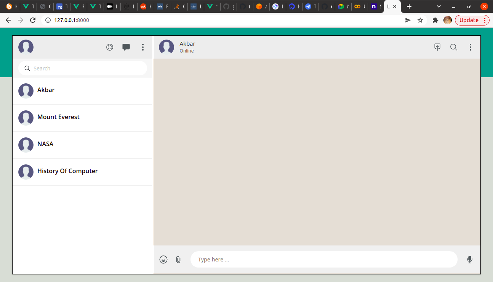
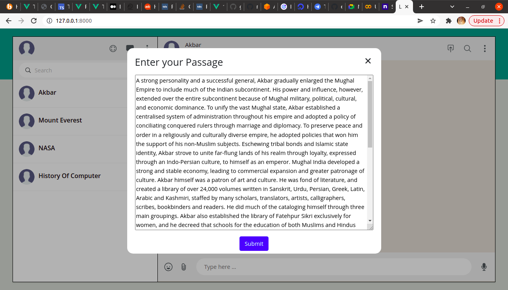

<h1 align="center">
    <b>Q&A Expert</b> 
<br>
</h1>

## What is this for?
This is a Machine learning Repository which predicts the answer questions based on the content of a given passage. using npm package ```@tensflow/qna```. 

## Models and technologies used.

The model can be used to build a system that can answer users’ questions in natural language. It was created using a pre-trained BERT model fine-tuned on SQuAD 1.1 dataset.

(BERT)[https://github.com/google-research/bert], or Bidirectional Encoder Representations from Transformers, is a method of pre-training language representations which obtains state-of-the-art results on a wide array of Natural Language Processing tasks.

The model takes a passage and a question as input, then returns a segment of the passage that most likely answers the question. 


## Links to references

Github

https://github.com/tensorflow/tfjs-models/tree/master/qna

NPM package

https://www.npmjs.com/package/@tensorflow-models/qna

##  Vue Installation

Clone the Application on your local system.
After cloning the application on your local system use ```cd QNA-TensorFlow-Vue```  command to go to the QNA-TensorFlow-Vue Directory 

Install the default dependencies by running the following command.


```npm install```


## To start your Local server


```npm run serve```

## Sample Images





## Sample Video


## Contributing

If you want to contribute to a project and make it better, your help is very welcome. Contributing is also a great way to learn more about social coding on Github, new technologies and and their ecosystems and how to make constructive, helpful bug reports, feature requests and the noblest of all contributions: a good, clean pull request.

